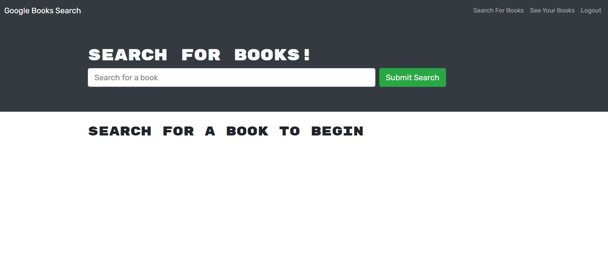

# book-search-engine
## Table of Contents
- [Description](##Description)
- [Installation](##How-to-install)
- [Usage](##Usage-information)
- [Contributing](##how-to-contribute)
- [Tests](##How-to-test-the-application)
- [GitHub](##Github-profile)
- [Contact](##Contact-me-via-email)
## Description
> This app allows you to search and save a list of books!

[See the deployed app here!](https://www.example.com)
## How To Install The Application
> Simply open the app and start looking for new things to read.
## Usage Information
> You can use this to keep track of all the books that you would like to read.
## How To Contribute
> If you would like to make contributions, please contact me via GitHub
## How To Test The Application
> Simply open the app and start searching!
## GitHub Profile
> github.com/alexandraws29 
## Contact Me Via Email
> <alexandraws29@outlook.com>
    